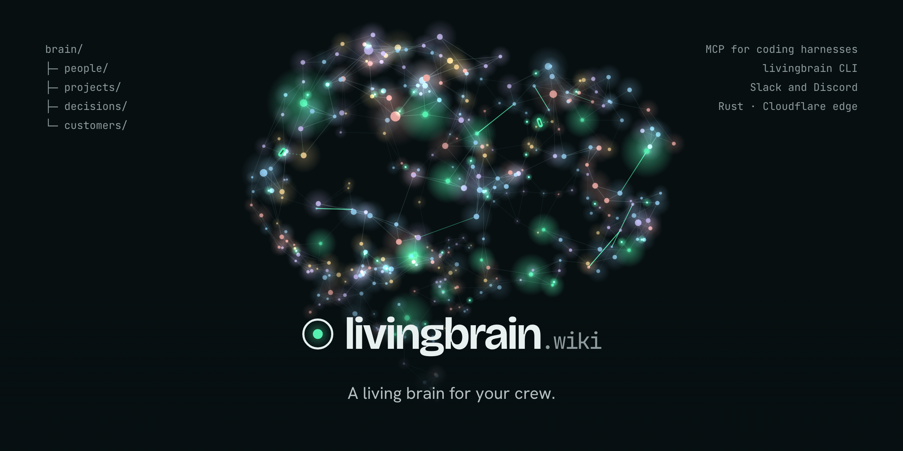

<p align="center">
  
</p>

<p align="center">
  
  
  
  
  
  
  
  
</p>

<p align="center">
  <b>livingbrain.wiki</b> · a <a href="https://factory0.ventures">Factory Zero</a> venture · sister to <a href="https://colonizer.dev">Colonizer</a>
</p>

---

# The site

This repository is the marketing site for **Living Brain**: a few short
static pages, one stylesheet, one page script and the brain renderer, served by Cloudflare (a static-assets Worker).
There is no framework, no bundler, no build step and no runtime dependency. It
follows the structure of the sealb.in and Colonizer sites.

| | What it is | Status |
| :--- | :--- | :--- |
| **Site** | This repository: the landing page, its metadata, `llms.txt`, the Open Graph card. | **Live** at livingbrain.wiki |
| **Waitlist** | A Cratefield waitlist Worker at `api.livingbrain.wiki` (`Livingbrain-wiki/waitlist-backend`), Turnstile-guarded, confirmation mail via Owlpost. | **Not deployed.** The Worker is wired but not live, so a submit shows an inline failure note |
| **Living Brain** | The product: a brain for your team, used from coding harnesses (MCP server), the `livingbrain` CLI, the PWA and team chat (Slack and Discord); hosted service. | **In design.** The page says so |

> **Your company, remembered.**

## The page

Ported from the Claude Design file **`Living Brain.dc.html`** (claude.ai/design
project `64188b59-b651-4bfe-803d-b8ef935c8fad`), kept in [`design-src/`](design-src)
with the `Brand Sheet.dc.html`, `brain.js` and `llms.txt` it came with. The
design's React runtime (`support.js`) is not shipped or committed:
markup and styles are static, and `assets/livingbrain.js` reimplements its logic.

| Page | What's on it |
| :--- | :--- |
| [`/`](index.html) | Short on purpose: the pitch, the waitlist and the rotating 3D brain; Listen, Write, Evolve as a bento of three looping illustrations; where you use it (coding harnesses, CLI, app, team chat: Slack and Discord) as one switcher over a device frame, with a row of harness logos; pricing as three cards; six link tiles; the footer waitlist |
| [`/how-it-works/`](how-it-works/index.html) | The team-chat thread (Slack shown) with its citation trail, the three animated steps and the pipeline, the nightly loop and one night in the brain, the explorable sample brain, acts and learns, You own it (`#own`) |
| [`/agents/`](agents/index.html) | Coding harnesses: the planned harnesses as a logo grid (`#harnesses`), connect tabs and the CLI, agents ⇄ brain, agent logs, the prompt library, the learning layer, fewer tokens and the open benchmark (`#tokens`), Colonizer (`#colonizer`) |
| [`/integrations/`](integrations/index.html) | Code, chat, mail, imports, monitoring and logs, models, sister ventures. Names with logos where allowed |
| [`/security/`](security/index.html) | Access rings and table, per-scope encryption, hidden-text screening, mail, telemetry, ownership |
| [`/pricing/`](pricing/index.html) | Community (free, self-hosted), Teams (from $5; hosted $9), Crew ($15); storage, usage, reasoning levels; planned |
| [`/faq/`](faq/index.html) | Every question, grouped, native `<details>`, with the `FAQPage` JSON-LD |
| [`/docs/`](docs/index.html) | Every document in one list with its status in words, generated from `tools/docs.json` by `tools/docs.js` |
| [`/privacy/`](privacy/index.html) | What the site collects: nothing beyond serving the pages, the theme choice in your own browser, and the waitlist email. Links to /security/ #subprocessors. Draft, legal review pending |
| [`/terms/`](terms/index.html) | The site is informational; Living Brain is in design and nothing is on sale; Polar as the future seller; Apache-2.0 open core. Draft, legal review pending |
| [`/guides/import-chatgpt/`](guides/import-chatgpt/index.html) | Export your ChatGPT history; the planned import |

Every page shares the header (a `<details>` menu under 860px) and the footer
with the second waitlist form.

Plus `404.html`, `llms.txt`, `sitemap.xml`, `robots.txt`, `site.webmanifest`,
`.well-known/security.txt` and the images.

## Design

Dark by default; light follows the system preference, and the header toggle
stores a choice as `lb-theme` (changing it fires a `lb-theme` event so the
canvases recolour). Fonts, self-hosted: **Bricolage Grotesque** (display),
**Hanken Grotesk** (body), **JetBrains Mono** (Markdown, labels, code). The
mark is a ring (the brain) around one live node in the accent.

| Token | Dark | Light |
| :--- | :--- | :--- |
| `--bg` | `oklch(0.16 0.014 215)` | `oklch(0.975 0.006 190)` |
| `--ink` | `oklch(0.95 0.008 200)` | `oklch(0.22 0.02 220)` |
| `--ink2` | `oklch(0.8 0.014 205)` | `oklch(0.4 0.02 215)` |
| `--accent` | `oklch(0.86 0.16 162)` | `oklch(0.48 0.11 165)` |
| `--t-person` / `project` / `decision` / `customer` | entity colours, graph nodes only | darker in light for AA |

Home page components (styles under "home: next-gen sections" in
`livingbrain.css`, behaviour under "home:" in `livingbrain.js`): `.hs` sections
(grid and glow backdrop, `.kick` mono label, `.hs__title`), `[data-reveal]`
(scroll reveal, staggered by `--i`), the `.bento` of `.mini` illustrations
(looping only while `.is-on`), the `[data-switcher]` tablist with `.dev` device
frames (auto-advance rides the `.sw__prog` CSS animation, so hover, focus and
off-screen pause it), `.tiers`, the `.lt` link tiles and `.ft--glow`.

Every animation sits on its final frame under `prefers-reduced-motion`; the
brains render still and the 3D views turn only when you turn them. Responsive
to 360px with no horizontal scroll.

## Layout

```
.
├── index.html                  the home page (short)
├── how-it-works/ agents/ integrations/ security/ pricing/ faq/ docs/
│   privacy/ terms/
│                               one index.html each, served at /<folder>/
├── guides/import-chatgpt/      the ChatGPT export guide
├── 404.html
├── assets/
│   ├── livingbrain.css         the whole design system, tokens at the top
│   ├── livingbrain.js          theme, infographics, sample graph, tabs, rings, waitlist; sample data
│   ├── brain.js                the 3D brain renderer (2D canvas, no dependencies), from the design
│   ├── fonts/                  Bricolage Grotesque, Hanken Grotesk, JetBrains Mono (OFL, latin, variable)
│   ├── favicon.svg             the mark
│   ├── logos/                  other companies' marks (Simple Icons), written by tools/marks.js
│   ├── harnesses.json          the planned coding harnesses (#38), source of the logo rows
│   ├── og.png                  Open Graph card
│   ├── icon-192.png  icon-512.png  icon-maskable-512.png  apple-touch-icon.png
│   ├── org-avatar.png          GitHub organization avatar, uploaded by hand
│   └── readme-banner.png       the banner above
├── tools/
│   ├── prerender.js            writes the no-JS state into the pages (still brain, demo, tabs, chart)
│   ├── marks.js                writes the logo rows and sprites from harnesses.json and integrations.json
│   ├── docs.json               the /docs/ list: one row per document and its status
│   ├── docs.js                 writes that list into docs/index.html between its markers
│   ├── integrations.json       the other planned integrations' marks and where each row goes
│   ├── fetch-simple-icons.sh   downloads the pinned Simple Icons release into tools/vendor/ (not committed)
│   ├── build-dist.sh           assembles dist/ from an allowlist, stamps cache hashes, checks the CSP hash
│   ├── deploy.sh               builds main in a throwaway worktree and deploys it
│   ├── og-render.html          source for og.png
│   ├── banner-render.html      source for the README banner
│   ├── avatar-render.html      source for the org avatar
│   └── render-og.sh            renders all of the above with headless Chrome
├── design-src/                 the Claude Design sources this page was ported from
├── .well-known/security.txt
├── llms.txt  robots.txt  sitemap.xml  site.webmanifest  _headers  _redirects
├── claude-design-prompt.md     the brief the design was made from
├── COPY.md                     every claim on the page, what backs it, and every divergence from the design
└── AGENTS.md                   rules for coding agents (CLAUDE.md points here)
```

## Local preview

```sh
python3 -m http.server 8080
# then http://localhost:8080/ (and /how-it-works/, /agents/, …)
```

Every page is complete without JavaScript: the menu is a native `<details>`, the hero shows a still brain (an
inline SVG), every infographic sits on its final frame, the demo shows a
static graph with one page open, the form falls back to `mailto:`, and the FAQ
is native `<details>`. After changing the sample data or `brain.js`'s
generator, rerun `node tools/prerender.js`.

## The waitlist

Every waitlist form (the hero and the footer on each page) posts
`{ "email": "...", "product": "livingbrain", "captchaToken": "..." }` as JSON to
`https://api.livingbrain.wiki/v1/waitlist`: a Cloudflare Worker running
[Cratefield](https://cratefield.com)'s harness `waitlist` module
(`Livingbrain-wiki/waitlist-backend`), the same contract as the sealb.in and
Shoal waitlists. `captchaToken` is a Cloudflare Turnstile token (sitekey
`0x4AAAAAAFRBNnN2m1opjElP`, managed, action `waitlist`); the widget script loads
on the first interaction with a form, and each form renders its own widget
under the field. The Worker binds the token to the apex hostname
`livingbrain.wiki` only, so `www.livingbrain.wiki` must redirect to the apex
(Cloudflare Redirect Rule) or joins from `www` fail the human check. The Worker
answers `202` on a join (also for an address already on the list), `400` with a
problem type ending `/captcha-failed` for the human check, `429` when rate
limited. It mails a confirmation link through Owlpost from
`no-reply@send.livingbrain.wiki`, so the success note says to check the inbox.
Any failure shows an inline note with the address; it never fakes a success.
Without JavaScript the form falls back to `mailto:hello@livingbrain.wiki`.

## Installable

`site.webmanifest` makes the marketing site installable (standalone, theme
colours from the tokens, 192/512 and maskable icons, Apple meta tags). There is
no service worker: the site is a few static pages and nothing should cache the waitlist
POST. The planned Living Brain web app (a PWA) is a product feature, not this site.

## Regenerating images

```sh
./tools/render-og.sh
```

The OG card, banner and avatar use the same `assets/brain.js` as the site,
frozen on one frame, with the self-hosted fonts and the dark theme pinned.
Upload `assets/org-avatar.png` by hand on the GitHub organization's settings
page; GitHub has no API for it.

## Deploy

A Cloudflare Worker with static assets, `livingbrain-website` (`wrangler.toml`), on
the Factory0 account. It has no script: Cloudflare serves `dist/` and applies
`_headers` and `_redirects`. `livingbrain.wiki` and `www.livingbrain.wiki` are its
custom domains, attached by the deploy itself. The `api.livingbrain.wiki` waitlist
Worker does not exist yet. For every merge to `main`:

```sh
tools/deploy.sh              # deploy origin/main
tools/deploy.sh --dry-run    # build it and say what would ship
```

The script deploys **`origin/main` and nothing else** (or local `main` while
there is no remote): it checks it out into a throwaway worktree, builds there,
deploys that and removes it. It never reads your working copy or its `dist/`.
Do not run `wrangler deploy` from a working copy by hand. Every absolute URL in the
metadata points at `https://livingbrain.wiki`.

## House rules for edits

1. **The product is in design.** Every mock is labelled; prices are planned;
   `llms.txt` tells agents nothing can be installed. See [`COPY.md`](COPY.md).
2. **The design file is the source.** Visual changes start in the Claude
   Design project, then get ported; note anything that diverges in `COPY.md`.
3. **The FAQ moves together.** The visible FAQ on `/faq/`, its JSON-LD `FAQPage` and
   `llms.txt` say the same thing. Change one, change all three.
4. **One claim, one page.** Say it once and link to it. A new page goes into
   `tools/build-dist.sh` (`PAGES`), `sitemap.xml` and `llms.txt`.
5. **No dark patterns.** One email when there's something to try.

---

<p align="center">
  <sub>No tracking, no cookies, no third-party requests · Built by <a href="https://factory0.ventures">Factory Zero</a></sub>
</p>
